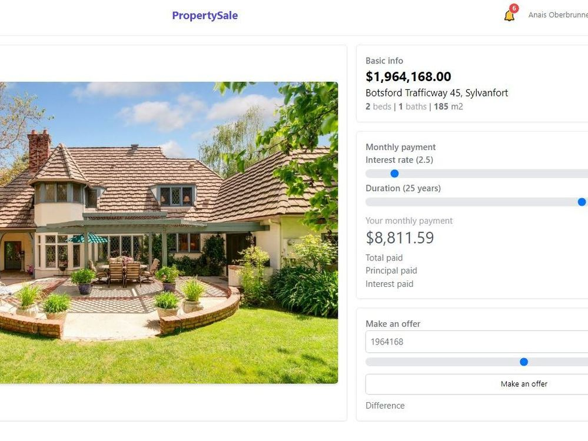
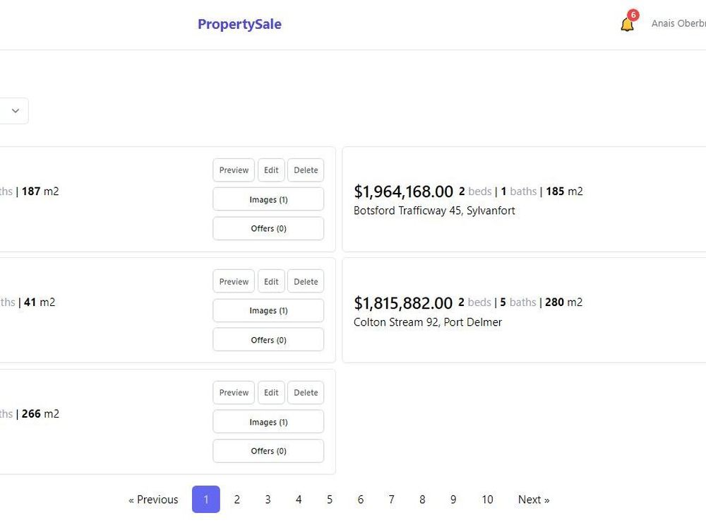
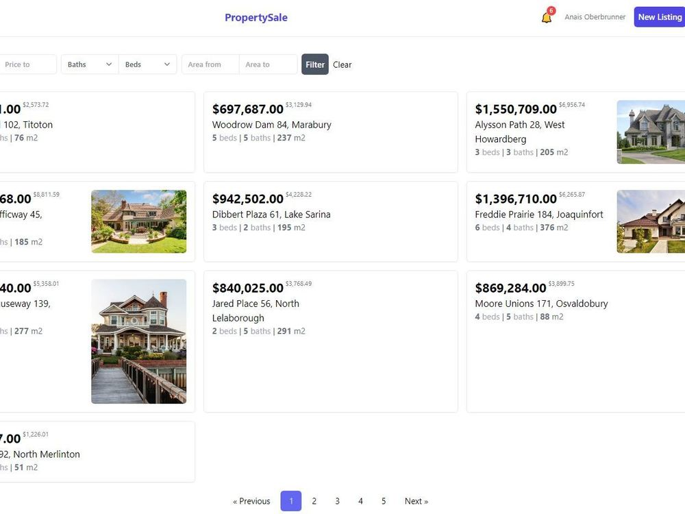

# PropertySale App

Full-stack app with Laravel + MySQL + Inertia js + Vue stack. Real estate auction application with authentication and authorization, filtering.

### :space_invader: Images

 
 
 

### :space_invader: Tech Stack

  
  <ul>
    <li><a href="#/">PHP</a></li>
    <li><a href="#/">Laravel</a></li>
    <li><a href="#">Inertia js</a></li>
    <li><a href="#">Vue</a></li>
    <li><a href="#">MySQL</a></li>
  </ul>

 

## 💥Demo (Deployed on VPS Hosting)
http://laravel-web.site/
